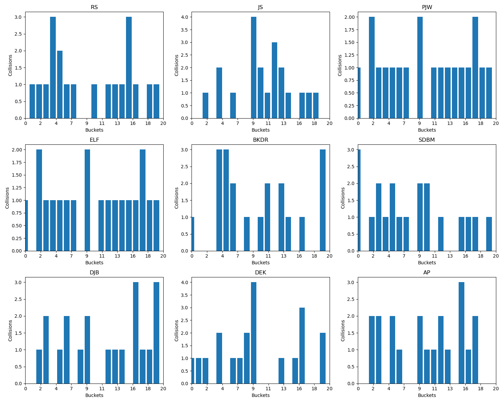
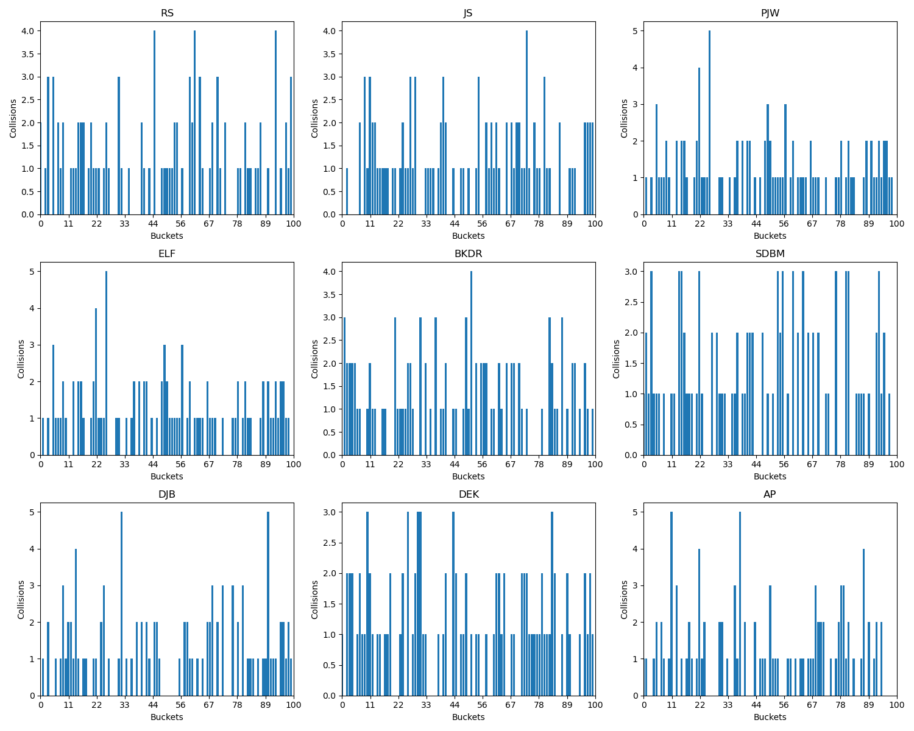
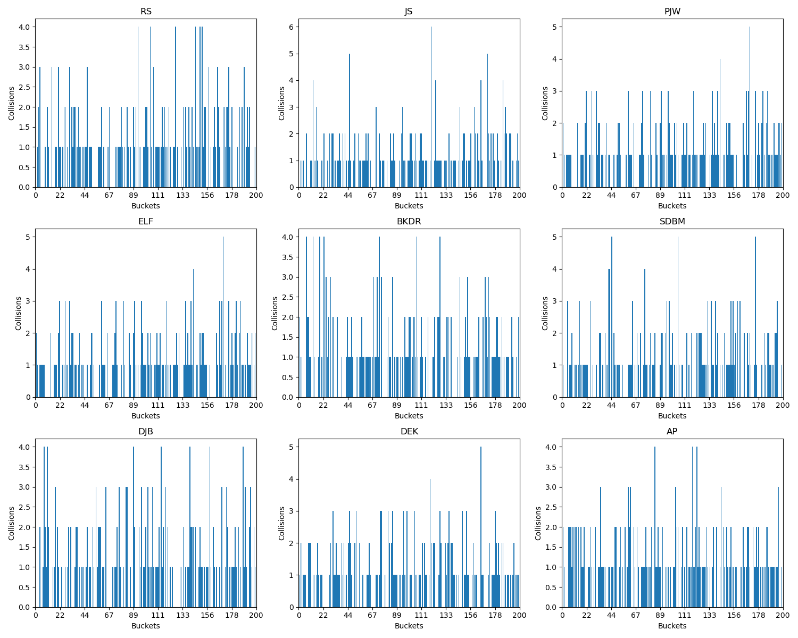
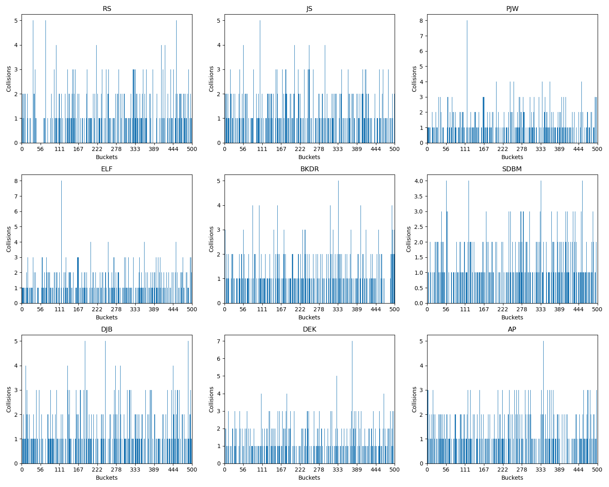
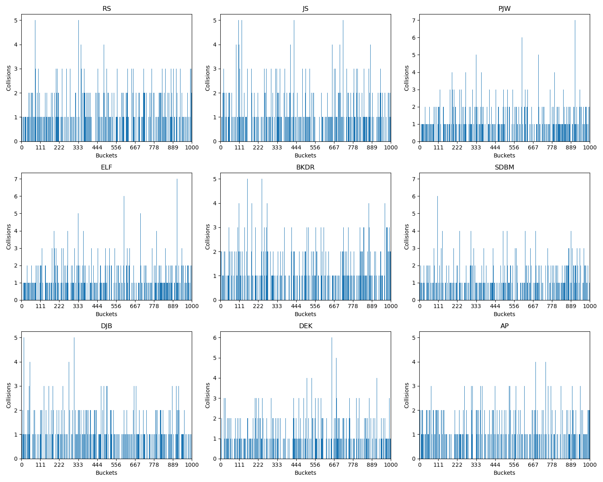

# Hash research

## Generator

```bash
build/stats --help
# Tool to generate JSON with hash collisions statistics for 9 different algorithms
#
#
# build/stats [OPTIONS]
#
#
# OPTIONS:
#   -h,     --help              Print this help message and exit
#           --length UINT REQUIRED
#                               Length of random strings
#           --count UINT REQUIRED
#                               The number of random strings
#   -o,     --output TEXT REQUIRED
#                               Path to the output JSON with statistics
```

## Chart drawer

```bash
python3 scripts/chart.py --help
# usage: chart.py [-h] --input INPUT --xmax XMAX --output OUTPUT
#
# Plot bar charts from JSON data
#
# options:
#   -h, --help       show this help message and exit
#   --input INPUT    Path to input JSON file
#   --xmax XMAX      Maximum value on the X-axis
#   --output OUTPUT  Path to output image file
```

## Experiment

N random strings of length 20 were generated, where N is 20, 100, 200, 500 and 1000. For each set
of strings all 9 hash functions were evaluated and their results were saved as remainders of the
division by the number of strings in the set.

## Results







## Conclusion

To me all functions seem OK. I would say, ELF and PJW look like the best choices, but this is an
almost unjustified assertion.
